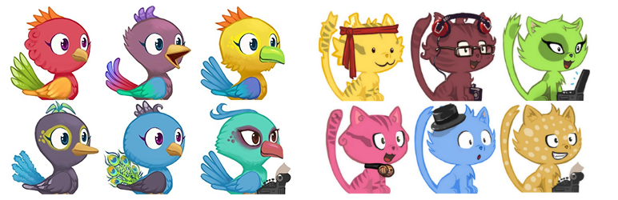

# Cat Generator Avatars

[](https://travis-ci.org/NoahDragon/cat-generator-avatars)
[](https://github.com/NoahDragon/cat-generator-avatars/releases)
[](https://wordpress.org/plugins/cat-generator-avatars)
[](https://wordpress.org/plugins/cat-generator-avatars/)
[](https://wordpress.org/plugins/cat-generator-avatars/)
[](https://github.com/NoahDragon/cat-generator-avatars/blob/master/LICENSE)

## Description

This plugin integrates the [Cat Generator](http://www.peppercarrot.com/en/article391/cat-avatar-generator) and [Bird Generator](https://www.davidrevoy.com/article720/bird-avatar-generator) avatar into WordPress.

## Installation

This plugin requires **PHP 5.4** above.

1. Download the latest stable version from [wordpress.org](https://wordpress.org/plugins/cat-generator-avatars/).
> If you would like to get the development build:
```bash
curl -L https://api.github.com/repos/NoahDragon/cat-generator-avatars/tarball > cat-generator-avatars.tar.gz
```
> Or
```bash
git clone https://github.com/NoahDragon/cat-generator-avatars.git
```
2. Upload the `cat-generator-avatars` folder to the `/wp-content/plugins/` directory on your web server.
3. Activate the plugin through the _Plugins_ menu in WordPress.
4. Select _Cat Avatars (Generated)_ as default avatar setting on the _Discussion Settings_ page in your WordPress backend.

## Screenshots

**Default Avatar setting** - Here you can select _Adorable Avatars_ as default avatar setting.

  

**Preview** - Enjoy the cute cat in your discussion. [Live Demo](http://legofan.cc/hello-world/#comments-title)

  


## Contribution

If you have a feature request, or if you have developed the feature already, please feel free to use the Issues and/or Pull Requests section.

Of course, you can also provide me with [translations](https://translate.wordpress.org/projects/wp-plugins/cat-generator-avatars) if you would like to use the plugin in another not yet included language.

## License

Copyright (c) 2020 Abner Chou

This code is licensed under the [BSD-3 License](LICENCE).

**Artworks:**
PNG and ORA files licensed under: [CC-By 4.0](https://creativecommons.org/licenses/by/4.0/) attribution: David Revoy with the following exception: Generated cats used as Avatar (for blog,forum,social-network) don't need direct attribution and so, can be used as regular avatars without pasting David Revoy's name all over the place.

**Code**
A derivation from the original [MonsterID by Andreas Gohr's](https://www.splitbrain.org/blog/2007-01/20_monsterid_as_gravatar_fallback), PHP licensed under the short, simple and permissive:
[MIT License](https://en.wikipedia.org/wiki/MIT_License)


